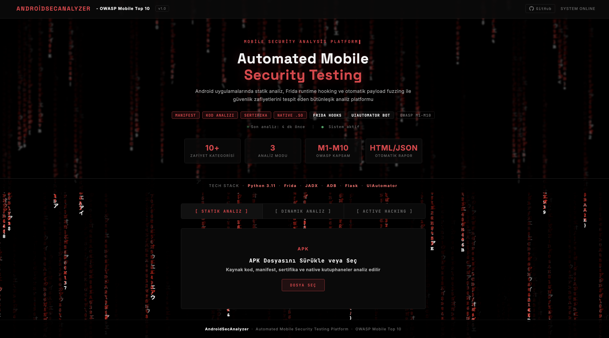
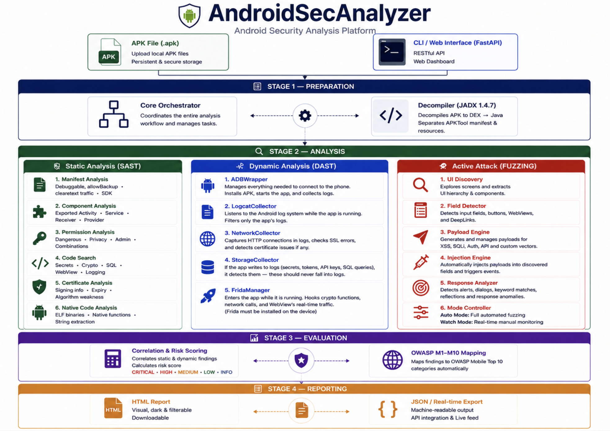

# AndroidSecAnalyzer

   

### Android Application Security Analysis Tool

> A comprehensive security analysis platform that automatically detects vulnerabilities in Android applications using both static and dynamic analysis techniques.



---

   

---

## About

**AndroidSecAnalyzer** is a comprehensive security analysis tool that automatically detects, classifies, and reports security vulnerabilities in Android applications (APK files) based on the **OWASP Mobile Top 10** standards.

The tool performs both **static analysis** (without running the app) and **dynamic analysis** (at runtime), then **correlates findings** from both to provide a comprehensive security assessment with a unified risk score.

---

## Features

### Static Analysis

Detects security vulnerabilities by analyzing source code and configuration files **without running** the APK.

- **Manifest Analysis** — Permissions, components, security flags
- **Source Code Scanning** — Weak cryptography, hardcoded secrets, SQL injection
- **Certificate Validation** — Signature verification, weak algorithm detection
- **Native Code Analysis** — .so files, ELF security flags, dangerous functions

### Dynamic Analysis

Detects behavioral security vulnerabilities by monitoring the application **at runtime**.

- **Network Traffic Monitoring** — HTTP/HTTPS analysis, SSL/TLS bypass detection
- **Runtime Behavior Analysis** — Hooking and monitoring with Frida
- **Data Storage Inspection** — Sensitive data leakage detection via logcat
- **API Communication Analysis** — Insecure endpoint detection

### Correlation Engine

Cross-references static and dynamic findings to validate and prioritize vulnerabilities.

- **Finding Correlation** — Matches static code patterns with runtime behavior
- **Severity Boost** — Confirmed vulnerabilities get elevated severity
- **OWASP Classification** — Automatic categorization per OWASP Mobile Top 10
- **Risk Scoring** — Weighted 0-10 risk score with breakdown

### Reporting

Professional security reports in multiple formats.

- **HTML Reports** — Dark-themed, responsive visual reports
- **JSON Reports** — Machine-readable structured output
- **OWASP Breakdown** — Category-by-category findings

---

## Architecture

The project is designed with a **modular architecture**. Each analysis module can operate independently, and results are aggregated by the central orchestrator.



---

## Analysis Details

### Manifest Analysis

| Check | Description | Severity |
|:---|:---|:---:|
| Dangerous Permissions | SMS, location, camera, microphone access | HIGH |
| Permission Combinations | Risky pairs like INTERNET + READ_SMS | CRITICAL |
| Exported Components | Exposed Activities, Services, Providers | HIGH |
| Debuggable Flag | Applications left in debug mode | CRITICAL |
| Cleartext Traffic | Allowing unencrypted HTTP traffic | HIGH |

### Source Code Analysis

| Check | Description | Severity |
|:---|:---|:---:|
| Weak Cryptography | MD5, SHA1, DES, RC4, ECB mode | CRITICAL |
| Hardcoded Secrets | API keys, passwords, tokens, private keys | CRITICAL |
| SQL Injection | SQL queries with string concatenation | HIGH |
| WebView Security | JavaScript enabled, file access | HIGH |
| Sensitive Data Logging | Logging passwords/tokens in plaintext | MEDIUM |

### Certificate Analysis

| Check | Description | Severity |
|:---|:---|:---:|
| Debug Certificate | Debug certificate used in production | CRITICAL |
| Expired Certificate | Certificate validity has expired | CRITICAL |
| Weak Algorithm | MD5withRSA, SHA1withRSA | HIGH |
| Self-Signed | Self-signed certificate detected | MEDIUM |

### Native Code Analysis

| Check | Description | Severity |
|:---|:---|:---:|
| Dangerous Functions | system(), exec(), gets(), strcpy() | CRITICAL |
| PIE Check | Security flag required for ASLR | HIGH |
| Hardcoded IP/URL | Embedded server addresses in binary | MEDIUM |
| Root Access | References to su commands | HIGH |

### Dynamic — Network Analysis

| Check | Description | Severity |
|:---|:---|:---:|
| HTTP Traffic | Unencrypted HTTP connections | HIGH |
| SSL Errors | SSL/TLS handshake failures | HIGH |
| Certificate Issues | Trust anchor validation failures | HIGH |
| TrustManager Bypass | Custom TrustManager / TrustAllCerts | HIGH |

### Dynamic — Storage Analysis

| Check | Description | Severity |
|:---|:---|:---:|
| Password in Logs | Passwords logged in plaintext | HIGH |
| Token Leakage | Authentication tokens in logs | HIGH |
| World-Readable Files | Files with insecure permissions | HIGH |
| External Storage | Sensitive data on SD card | MEDIUM |

---

## OWASP Mobile Top 10

All findings are classified according to **OWASP Mobile Top 10** standards:

| # | Category | Coverage |
|:---:|:---|:---|
| | M1 — Improper Platform Usage | Debuggable, low SDK, excessive permissions |
| | M2 — Insecure Data Storage | AllowBackup, sensitive data logging |
| | M3 — Insecure Communication | HTTP traffic, hardcoded IPs |
| | M4 — Insecure Authentication | Authentication controls |
| | M5 — Insufficient Cryptography | MD5, DES, ECB, hardcoded keys |
| | M6 — Insecure Authorization | Exported components |
| | M7 — Client Code Quality | SQL injection, dangerous C functions |
| | M8 — Code Tampering | Debug certificate, weak signatures |
| | M9 — Reverse Engineering | Hardcoded secrets, API key leakage |
| | M10 — Extraneous Functionality | Suspicious commands, auto-start |

---

## Technologies

| Category | Technology |
|:---|:---|
| **Language** | Python 3.x |
| **CLI** | Click Framework |
| **Configuration** | PyYAML |
| **Testing** | Pytest |
| **Binary Analysis** | struct, zipfile, hashlib |
| **Dynamic Analysis** | Frida, ADB |
| **Certificate** | keytool (JDK) |
| **Reporting** | HTML, JSON |

---

## Project Structure

```
AndroidSecAnalyzer/
├── androidsec/
│ ├── cli/ # CLI interface (Click)
│ │ └── commands/ # scan, report commands
│ ├── core/ # Main engine & configuration
│ │ ├── analyzer.py # Central orchestrator
│ │ ├── config_manager.py # YAML configuration
│ │ ├── constants.py # Project-wide constants
│ │ └── exceptions.py # Custom exceptions
│ ├── static_analysis/ # Static analysis module
│ │ ├── manifest/ # AndroidManifest.xml analysis
│ │ ├── code/ # Source code scanning
│ │ ├── certificate/ # Certificate validation
│ │ └── native/ # Native .so analysis
│ ├── dynamic_analysis/ # Dynamic analysis module
│ │ ├── device/ # ADB wrapper & device manager
│ │ ├── collectors/ # Logcat, network, storage
│ │ └── frida/ # Frida hooks & scripts
│ ├── correlation/ # Finding correlation & risk scoring
│ │ ├── correlator.py # Static-dynamic correlation
│ │ └── risk_calculator.py # Weighted risk scoring
│ ├── reporting/ # Report generation
│ │ ├── generator.py # Report orchestrator
│ │ ├── html_formatter.py # HTML report template
│ │ └── json_formatter.py # JSON report formatter
│ └── utils/ # Utilities & logging
├── config/ # Configuration files
├── data/ # Vulnerability databases
├── tests/ # Unit & integration tests
├── input/ # APK files for analysis
└── output/ # Analysis results & reports
```

---

## Project Statistics

| Metric | Value |
|:---|:---:|
| Total Lines of Code | **~9,000** |
| Security Checks | **40+** |
| OWASP Category Coverage | **10/10** |
| Analysis Modules | **8** |
| Report Formats | **2** |

---

## Project Status

- [x] Project architecture and modular design
- [x] Static analysis module (manifest, code, certificate, native)
- [x] CLI interface
- [x] Test infrastructure and unit tests
- [x] Dynamic analysis module (ADB, logcat, network, storage)
- [x] Frida integration (crypto hooks, network hooks)
- [x] Static + dynamic correlation engine
- [x] Risk scoring system
- [x] Report generation (HTML + JSON)
- [x] Comprehensive testing phase

---

## License

This project is licensed under the [MIT License](LICENSE).

---

> *AndroidSecAnalyzer — Comprehensive Android Security Analysis Tool*
